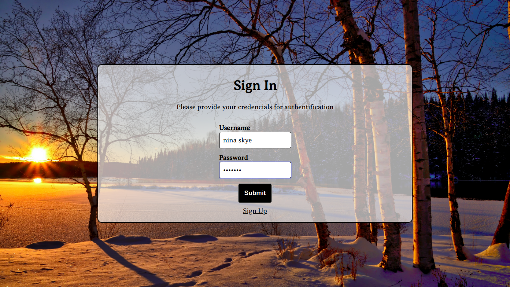

# README

<!-- PROJECT LOGO -->
<br />
<p align="center">
  <a href="https://github.com/patriciachrysy/weather-api-app.git">
    
  </a>

  <h3 align="center">Weather API Service</h3>

  <p align="center">
    <br />
    <a href="https://github.com/patriciachrysy/weather-api-app.git"><strong>Explore the docs »</strong></a>
    <br />
    <br />
    <a href="https://github.com/patriciachrysy/weather-api-app.git/issues">Report Bug</a>
    ·
    <a href="https://github.com/patriciachrysy/weather-api-app.git/issues">Request Feature</a>
  </p>
</p>

<!-- ABOUT THE PROJECT -->
## About The Project

This is a weather api service that provides complete weather informations for any city in the world in JSON format. Any user who wishes to use it mus register in order to get instructions about how to call and use the app.



### Built With
This project was built using these technologies.
* Ruby & Ruby on Rails
* HTML / CSS 
* PostgreSQL
* Rubocop
* Stylelint
* GithubActions
* VSCode
Ruby on Rails was choosen firstly because it way faster than the other backend framework i use(Symfony), the code is very light, the scalability(can bear many request at a time, wich is very usefull for an API service), and also because it is part of Thinkinfic stack.

### Date
Submitted on the 03rd March 2021
### Location of deployed application
The app was deployed on Heroku server at the address [weather_api_app](https://sleepy-waters-25554.herokuapp.com/)
### Time spent
I spent 4 hours working on this test
### Assumptions made
I assumed that the service should be accessible only to authenticated users and that all the weather data provided by OpenWeather Api should be returned in JSON format when the API is called.
### Shortcuts/Compromises made
I choose to create my own authentication system and could not have enough time to make it perfect. I think that could have been done better in a real world application. It would have also been better to add a JWT authentication to the API for security.
### Stretch goals attempted
I attempted all the stretch goals and everything went quite well. As i mentionned above, i could have added JWT authentication to the API or generate a temporary token for security. However, that would have alter the basic structure of the API call as required in the test.
### Instructions to run assignment locally

#### Getting Started

To get a local copy up and running follow these simple example steps.

#### Prerequisites

Ruby: 2.7+
Rails: 6+

#### Clone
* [download](https://github.com/patriciachrysy/weather-api-app/archive/refs/heads/main.zip) or clone this repo:
  - Clone with SSH:
  ```
    git@github.com:patriciachrysy/weather-api-app.git
  ```
  - Clone with HTTPS
  ```
    https://github.com/patriciachrysy/weather-api-app.git

#### Setup

Install gems with:

```
$ bundler install --without production
```

Setup database with:

```
$ rails db:migrate
$ rails db:seed
```

#### Usage

Start server with:

```
$ rails server
```

Open `http://localhost:3000/` Creste an account and follow the instructions mentionned on the homepage 


### What did you not include in your solution that you want us to know about?
Nothing to mention

### Other information about your submission that you feel it's important that we know if applicable.
Nothing to mention

### Your feedback on this technical challenge
Maybe it could have been better to let the applicant add a extended structure to the API.
